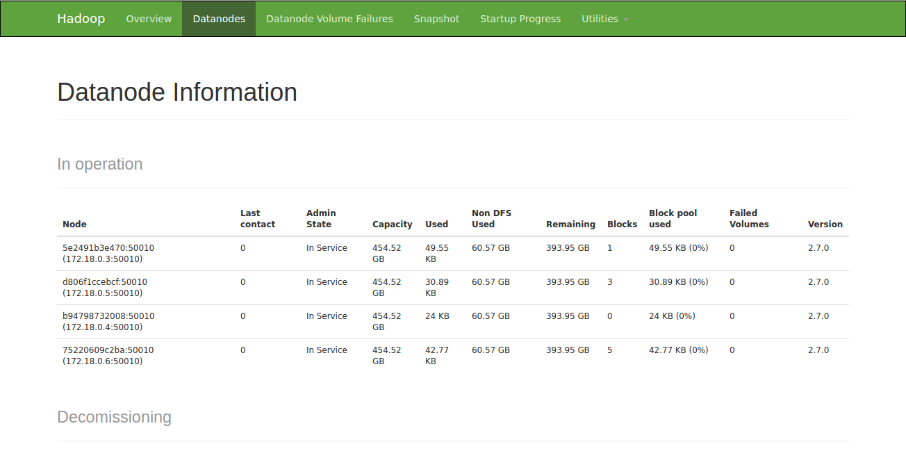

# csse291e-project3
#### Subdirectories
* intro/ is the materials given by instructors.
* code1/ is **executing Hadoop wordcount** on a single Hadoop using Docker.
* code2/ is executing Hadoop wordcount **on one master and four slaves** using Docker.
* code3/ is executing Hadoop **bigram** on one master and four slaves using Docker.
#### Status of Hadoop in Docker (code3)

